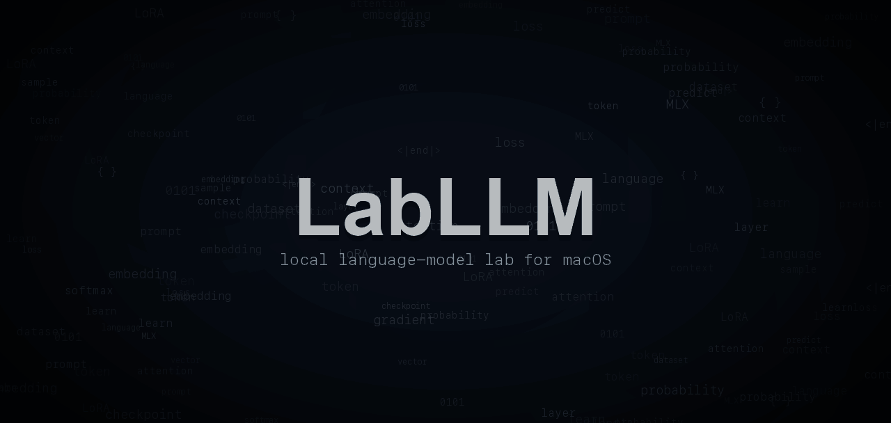
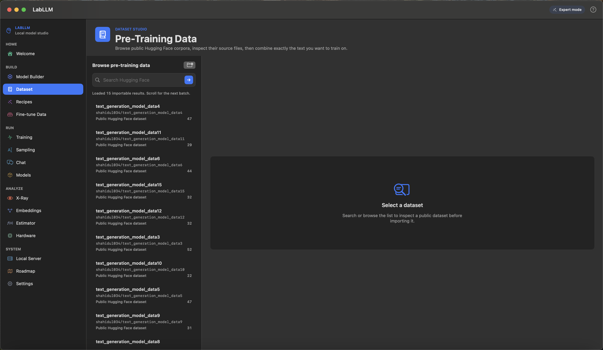
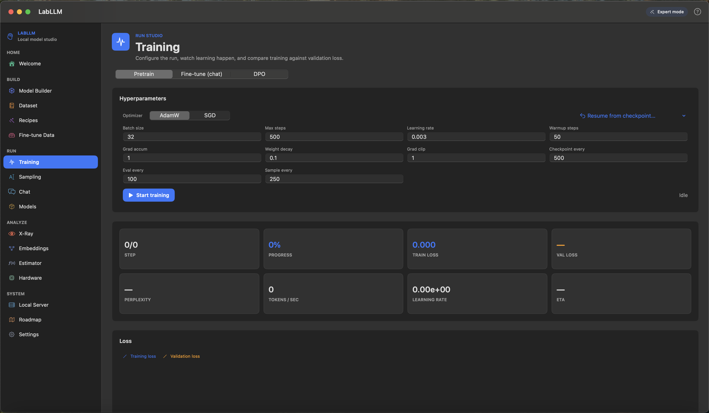
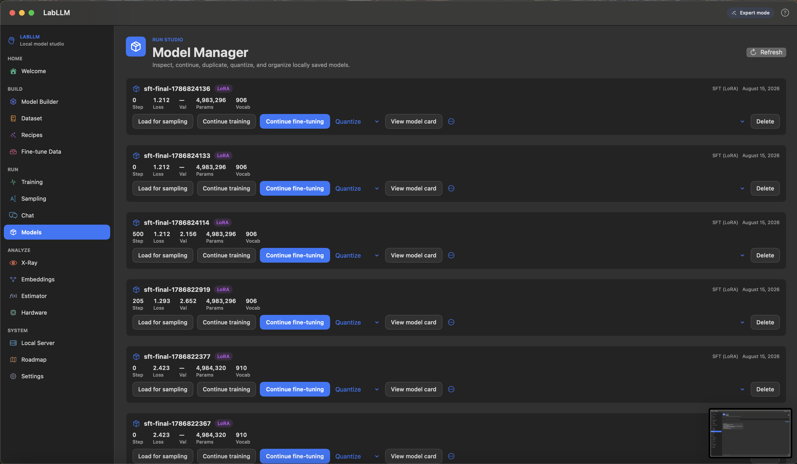

<p align="center">
  
</p>

<p align="center">
  <strong>Train language models you can actually talk to.</strong>
</p>

<p align="center">
  <a href="https://greninja9257.github.io/LabLLM/"><strong>Website</strong></a>
  ·
  <a href="https://github.com/Greninja9257/LabLLM/releases"><strong>Download the latest beta</strong></a>
  ·
  <a href="CONTRIBUTING.md"><strong>Contribute</strong></a>
  ·
  <a href="https://github.com/Greninja9257/LabLLM/discussions"><strong>Discussions</strong></a>
</p>

<p align="center">
  <a href="https://github.com/Greninja9257/LabLLM/discussions"></a>
  <a href="https://github.com/Greninja9257/LabLLM/issues"></a>
  <a href="https://github.com/Greninja9257/LabLLM/pulls"></a>
  <a href="https://github.com/Greninja9257/LabLLM/stargazers"></a>
  <a href="https://github.com/Greninja9257/LabLLM/graphs/contributors"></a>
</p>

> [!WARNING]
> **LabLLM is beta software.** This build can train and fine-tune real models, but it is **not** representative of the final product. Expect bugs, missing features, and fast-moving updates. Keep backups of important projects and report anything that breaks.

LabLLM is a free, native macOS GUI for training small Transformer and LLM models from scratch with your own datasets. Build a GPT-style model with random initialization, train it with Apple Silicon and MLX, inspect live training metrics, save checkpoints, continue experiments, fine-tune behavior, and chat with the model you trained.

It is built with SwiftUI and Apple MLX for people who want the full model-building loop in one place: data, tokenizer, architecture, training, fine-tuning, sampling, chat, checkpoints, and model management. Models, datasets, checkpoints, chats, and experiments stay on your machine.

## Why?

Because training a small language model should be something you can explore directly. LabLLM puts the model builder, dataset browser, tokenizer, training dashboard, fine-tuning flow, sampler, chat, checkpoints, and model management in one place, so you can move from idea to experiment without rebuilding your workflow each time.

## A Small Peek

<table>
  <tr>
    <td width="50%"></td>
    <td width="50%"></td>
  </tr>
  <tr>
    <td><strong>Bring data</strong><br/>Search Hugging Face, inspect what you found, then import actual trainable files with clear metadata and previews.</td>
    <td><strong>Watch learning</strong><br/>Blue train loss, orange validation loss, progress, throughput, and live samples in one place.</td>
  </tr>
  <tr>
    <td colspan="2"></td>
  </tr>
  <tr>
    <td colspan="2"><strong>Keep the useful runs</strong><br/>Load, continue, rename, quantize, and compare checkpoints without losing track of the experiment.</td>
  </tr>
</table>

## Does it work?

Yes. It builds with Swift Package Manager and runs as a native macOS app.

It can design a GPT-style model, import text and instruction data, train, fine-tune, sample, chat, save checkpoints, export model cards, and serve a local OpenAI-shaped endpoint.

It can train models from scratch, fine-tune them on instruction or conversation data, and let you chat with the result naturally inside the same app.

## Requirements

- macOS 14+
- Apple Silicon, M1 or newer
- Xcode 15+ recommended
- Swift Package Manager
- Time for the first MLX build to complete

The package pins `mlx-swift` to `0.31.6`.

## Build & Run

```bash
swift build
swift run LabLLM
```

If MLX gets confused after a dependency update, try:

```bash
swift package reset
swift build
```

The app bundles the MLX Metal library needed for the SwiftPM build. Full Xcode is still recommended if you want to rebuild MLX itself.

## What Can It Do Right Now?

Quite a bit, actually.

| Area | Current vibe |
| --- | --- |
| Model building | GPT-style decoder presets, validation, estimates, and enough knobs to make Expert mode feel legally responsible. |
| Data | Hugging Face browsing, local import, iMessage import, dataset mixing, row limits, percentages, and progress for big jobs. |
| Training | Pretraining, SFT, LoRA, DPO, live metrics, validation curve, samples, checkpoints, pause/resume/stop. |
| Playing | Sampling, chat, X-Ray token inspection, embeddings, local server, quantized exports. |
| Customization | Themes, accent, density, sidebar width, feature visibility, tutorial preferences, and deep controls for serious experiments. |

### Completed Features

- Local-first macOS app with no account and no subscription
- Apple Silicon + MLX acceleration
- Simple, Advanced, and Expert modes
- Customizable appearance, accent color, density, panel opacity, sidebar width, and feature visibility
- Welcome screen with animated background
- Persistent tutorial progress and guided setup overlay
- GPT-style decoder model builder
- Tiny, small, medium, and large-ish model presets
- Live parameter, memory, disk, and rough training estimates
- Character, byte, and trained BPE tokenizers
- Automatic tokenizer build in Simple mode
- Pre-training data browser for Hugging Face datasets
- Fine-tuning data browser for Hugging Face datasets
- Local TXT, JSON, JSONL, CSV-ish, and iMessage import paths
- Dataset mixing with percentages or row limits
- Download/import progress for big data tasks
- Chunked local file loading so large files do not freeze everything immediately
- Pretraining with AdamW/SGD, warmup, cosine LR, gradient clipping, gradient accumulation, checkpoints, pause, resume, and stop
- Supervised fine-tuning with chat templates and assistant-only loss masking
- LoRA fine-tuning
- DPO preference training
- Training dashboard with loss, validation loss, perplexity, LR, throughput, ETA, and percent progress
- Validation loss as a separate configurable-color curve
- Live sample timeline during training and fine-tuning
- Sampling playground with temperature, top-k, top-p, min-p, repetition penalty, seed, stop sequences, greedy mode, and continuation
- Inline generation display in the prompt area
- Local chat playground
- X-Ray token inspector with probabilities, entropy, and top alternatives
- Embedding explorer with PCA-style 2D projection and relaxation
- Model manager for loading, continuing, duplicating, renaming, quantizing, and organizing checkpoints
- Safetensors-style checkpoint save/load flow
- Automatic Markdown model card generation
- 4-bit and 8-bit quantized model export
- Local OpenAI-shaped HTTP server with streaming responses
- Hardware profiler and resource estimator
- Recipes for quick starts
- In-app roadmap sorted into completed, in-progress, and planned work

## In Progress

These are partially present or actively being shaped into something less chaotic.

- Fuller Tokenizer Lab with tokenizer comparison, Unicode analysis, heatmaps, and richer token statistics
- Dataset Studio polish: stronger filtering, sorting, provenance, versioning, and better previews
- Curated dataset catalog with better metadata, licenses, caching, and update notices
- Experiment tracking for runs, datasets, tokenizers, hardware, software versions, notes, and comparisons
- Checkpoint timeline and model evolution views
- Better sampling history, generation comparison, exports, logprobs, and entropy displays
- Deeper X-Ray mode with attention, layer, head, activation, residual stream, MLP, and neuron explorers
- Fine-tuning workflow improvements, including better validation, packing, adapter management, and comparisons
- Model import/export polish for Hugging Face-compatible models, LoRA adapters, tokenizer configs, and reproducibility bundles
- Quantized model loading and direct quantized sampling
- Hardware monitoring for thermal, power, GPU, and Neural Engine details
- Local server request logs, token usage, latency stats, and model health views
- Interactive lessons, smarter tutorial coverage, and an eventual local teaching assistant
- UX customization, accessibility controls, documentation, error explanations, and privacy controls

## Planned Features

This is where the ambition lives. Some of it is sensible. Some of it is probably wearing a lab coat it found in a closet.

- Project management with templates, notes, tags, history, snapshots, backups, import, and export
- Data cleaning: deduplication, normalization, boilerplate removal, spam filtering, toxicity checks, PII detection, and before/after previews
- Dataset analytics: token distributions, language distributions, quality scores, diversity scores, charts, and histograms
- Evaluation suites for perplexity, reasoning, math, coding, instruction following, long context, hallucination, consistency, and safety
- Evaluation builder with exact match, semantic scoring, regex scoring, LLM-as-judge scoring, and custom scoring functions
- Model comparison across checkpoints, architectures, datasets, tokenizers, prompts, speed, memory, and quality
- Attention Lab, Transformer Lab, Context Lab, KV Cache Lab, Prompt Lab, RAG Lab, and Tool/Function Calling Lab
- RAG workflows with document import, chunking, embeddings, local vector database, hybrid search, citation generation, and retrieval evaluation
- Safety testing for refusals, toxicity, bias, hallucination, prompt injection, and jailbreak resistance
- Scaling law experiments and break-the-model experiments
- Smart training assistant for hyperparameter suggestions, memory warnings, data-quality warnings, overfitting alerts, and "why did my model get worse?" analysis
- Automation pipelines: pretraining -> SFT -> DPO, automatic evaluation, checkpoint selection, export, sweeps, and experiment ranking
- Reproducibility reports with seeds, dataset versions, tokenizer versions, model configs, hardware, software, MLX version, macOS version, hashes, and one-click reproduction
- Community sharing for models, datasets, recipes, experiments, benchmarks, and model cards
- Collaboration features like shared projects, comments, reviews, approvals, and team workspaces
- Python API, CLI, local REST API, SDK, WebSocket support, OpenAI-compatible serving, and API playground
- Future multimodal/voice work: image models, vision-language models, audio models, speech-to-text, text-to-speech, and voice fine-tuning
- "Magic" features like natural-language model design, automatic dataset recommendations, visual experiment notebooks, drag-and-drop training pipelines, and one-click local deployment

## Suggested User Flow

```text
Learn
-> Explore
-> Create project
-> Design model
-> Import data
-> Clean/analyze data
-> Configure training
-> Estimate resources
-> Train
-> Watch samples evolve
-> Inspect checkpoints
-> Sample/chat
-> Fine-tune
-> DPO
-> Compare
-> Quantize
-> Serve locally
-> Reproduce
-> Keep experimenting
```

You can also ignore the flow and click around. The app is built for exploration.

## Project Layout

```text
LabLLM/
├── Package.swift
├── Package.resolved
├── README.md
└── Sources/LabLLM/
    ├── LabLLMApp.swift
    ├── AppDelegate.swift
    ├── AppState.swift
    ├── Preferences.swift
    ├── LoadingState.swift
    ├── DataImportState.swift
    ├── Core/
    │   ├── GPT.swift
    │   ├── Trainer.swift
    │   ├── Sampler.swift
    │   ├── Tokenizer.swift
    │   ├── BPETokenizer.swift
    │   ├── TextDataset.swift
    │   ├── SFTDataset.swift
    │   ├── DPODataset.swift
    │   ├── ConversationImport.swift
    │   ├── HuggingFaceHub.swift
    │   ├── Checkpoint.swift
    │   ├── ModelServer.swift
    │   └── ...
    └── Views/
        └── One SwiftUI view per major sidebar section
```

## Should I Use This For Serious Work?

For learning, experiments, local model development, fine-tuning, and natural chat workflows: yes.

For replacing a production LLM stack with monitoring, evals, deployment, governance, and an on-call process: not yet. LabLLM is a powerful local builder, not a full production platform.

## Credits

Built on Apple's MLX and `mlx-swift`.

Also powered by the usual stack of coffee, compiler errors, and the ancient developer ritual of muttering "why is focus broken" at a screen.

## Contributing

Pull requests, issues, recipes, docs fixes, images, and ideas are welcome. Start with [CONTRIBUTING.md](CONTRIBUTING.md), use [Discussions](https://github.com/Greninja9257/LabLLM/discussions) for questions and early ideas, and keep pull requests focused.

## Contributors

Thanks goes to these wonderful people:

<!-- ALL-CONTRIBUTORS-LIST:START -->
<!-- prettier-ignore-start -->
<!-- markdownlint-disable -->
<table>
  <tbody>
    <tr>
      <td align="center" valign="top" width="14.28%"><a href="https://github.com/Greninja9257"><br /><sub><b>Greninja9257</b></sub></a><br /><a href="https://github.com/Greninja9257/LabLLM/commits?author=Greninja9257" title="Code">💻</a> <a href="https://github.com/Greninja9257/LabLLM/commits?author=Greninja9257" title="Documentation">📖</a> <a href="#design-Greninja9257" title="Design">🎨</a></td>
    </tr>
  </tbody>
</table>

<!-- markdownlint-restore -->
<!-- prettier-ignore-end -->

<!-- ALL-CONTRIBUTORS-LIST:END -->

This project follows the [All Contributors](https://allcontributors.org/) specification. Contributions of any kind are welcome.

## License

LabLLM project code is released under the MIT License. See `LICENSE`.

MLX is MIT licensed by Apple. Dataset and model licenses depend on what you import, so read the dataset cards before training anything you plan to share. The app will not read the license for you, because that would be too convenient.
